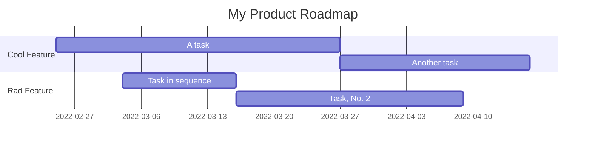

# Session 04

## Jupyter and Markdown

Course Hero

## Jupyter on the Cloud

**Integrated Development Environment**: An application that helps you develop software.

### [Jupyter Lite](https://jupyterlite.readthedocs.io/en/latest/)

### [Binder](https://mybinder.org)

### [Google Colab](https://colab.research.google.com/notebooks/welcome.ipynb#recent=true)

### [Kaggle](https://www.kaggle.com)

### [Deepnote](https://deepnote.com)

### [Sagemaker Studio Lab](https://studiolab.sagemaker.aws)

### [JetBrains Datalore](https://datalore.jetbrains.com)

### And dozen of others....

## Markdown

[Markdown Guide](https://www.markdownguide.org)

[Basic Markdown Syntax](https://www.markdownguide.org/basic-syntax/)

Free [Wes Bos Mastering Markdown Course](https://masteringmarkdown.com)

[Writing on GitHub](https://docs.github.com/en/get-started/writing-on-github)

### Advanced use:

When $a \ne 0$, there are two solutions to $(ax^2 + bx + c = 0)$ and they are 
$$ x = {-b \pm \sqrt{b^2-4ac} \over 2a} $$

## Feedback

Your Feedback Matters

Please helps us filling up the **[Feedback Form](https://docs.google.com/forms/d/e/1FAIpQLSf-yrrCkg66KFFimIk62me8jkSybb9wY1tdqhuRNKG1pchk5w/viewform)**.

## Next session

We will learn more about Python as a Language.

## Homework:

### Read the Article: [Your Brain Is an Energy-Efficient 'Prediction Machine'](https://www.wired.com/story/your-brain-is-an-energy-efficient-prediction-machine/)

### Optional: [In Search Of A Flat Earth](https://www.youtube.com/watch?v=JTfhYyTuT44)
